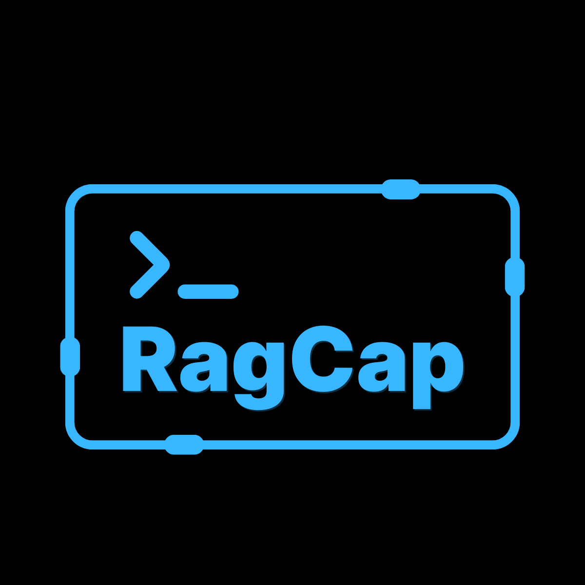

<p align="center">
  
</p>

<div align="center">

# RagCap

Portable RAG capsules as a single file you can build, inspect, search, ask, serve, and export — via a cross‑platform CLI and NuGet libraries.

</div>

---

## What Is RagCap?

- Single-file capsules: bundle sources, chunks, and embeddings into one `.ragcap` SQLite file.
- Three embedding providers: Local ONNX (bundled), OpenAI, Azure OpenAI.
- CLI-first: build, inspect, search, ask Q&A, diff, export, index (sqlite-vec), verify, and serve an HTTP API.
- Libraries: consume in .NET apps via `RagCap.Core` and export helpers via `RagCap.Export`.

## Install

### CLI as .NET Tool

- From NuGet:
  - Global: `dotnet tool install -g RagCap.CLI.Tool`
  - Local (tool manifest):
    - `dotnet new tool-manifest`
    - `dotnet tool install RagCap.CLI.Tool`

- From a local folder (for testing):
  - `dotnet tool install --tool-path .\.tools --add-source .\artifacts\nupkgs RagCap.CLI.Tool --version <version>`
  - Run with: `./.tools/ragcap --help`

### Libraries via NuGet

- Core library: `dotnet add package RagCap.Core --version <version>`
- Export helpers: `dotnet add package RagCap.Export --version <version>`

For local consumption during development, add `--source .\artifacts\nupkgs` to use locally packed `.nupkg` files.

## Configuration

RagCap reads configuration from three sources, in this precedence order:
1) CLI flags, 2) Environment variables, 3) Global config file.

### Global Config File

Path: `~/.ragcap/config.yml`

```yaml
api:
  apiKey: "sk-..."                 # OpenAI or Azure OpenAI API key
  endpoint: "https://api.openai.com/v1" # or your Azure endpoint base URL
  apiVersion: "2024-06-01"         # Azure API version if using Azure

embedding:
  provider: "local"                # local | api
  model: "text-embedding-3-small"  # required for api provider

answer:
  provider: "local"                # local | api
  model: "gpt-4o-mini"            # only used with provider=api
```

### Environment Variables

- Common
  - `RAGCAP_API_KEY`: API key for OpenAI or Azure OpenAI
  - `RAGCAP_API_VERSION`: API version (used by CLI when passing to providers)
  - `RAGCAP_ENDPOINT`: API base URL (OpenAI or Azure). The SDK auto-detects Azure if not `openai.com`.
  - `RAGCAP_AZURE_ENDPOINT`: Alternative name to force Azure OpenAI endpoint detection.
  - `RAGCAP_AZURE_API_VERSION`: Azure embeddings API version (default `2024-02-15-preview`)

- Embeddings
  - `RAGCAP_EMBEDDING_PROVIDER`: `local` or `api`
  - `RAGCAP_EMBEDDING_MODEL`: e.g., `text-embedding-3-small` for OpenAI, or your Azure deployment name

- Answers (Ask and Serve)
  - `RAGCAP_ANSWER_PROVIDER`: `local` or `api`
  - `RAGCAP_ANSWER_MODEL`: e.g., `gpt-4o-mini` or your Azure deployment name

- sqlite-vec / sqlite-vss
  - `RAGCAP_SQLITE_VEC_PATH`: path to sqlite-vec shared library (`sqlite-vec.dll`/`.so`/`.dylib`)
  - `RAGCAP_SQLITE_VEC_MODULE`: vec module name (default `vec0`)
  - `RAGCAP_SQLITE_VSS_PATH`: path to sqlite-vss shared library
  - `RAGCAP_SQLITE_VSS_MODULE`: vss module name (default `vss0`)
  - `RAGCAP_SQLITE_VSS_SEARCH`: vss search function name (default `vss_search`)
  - `RAGCAP_SQLITE_VSS_FROMBLOB`: vss from-blob function name

Notes:
- Local embedding provider uses the bundled ONNX model `all-MiniLM-L6-v2`. In the CLI tool package, the model ships inside the tool. If you use the library directly, place the model under `models/all-MiniLM-L6-v2/` next to your app binary, or use `provider=api`.
- For Azure OpenAI, set `RAGCAP_API_KEY` and either `RAGCAP_AZURE_ENDPOINT` or `RAGCAP_ENDPOINT` to your Azure base URL, and specify your deployment name as `--model`/config model. Provide `RAGCAP_AZURE_API_VERSION` or `--api-version`.

## Recipes (.ragcap.yml)

Use a recipe to define sources, chunking, preprocessing, and embedding settings.

```yaml
sources:
  - path: ./docs
    type: markdown
  - path: ./articles
    type: pdf
chunking:
  size: 500
  overlap: 50
  bertAware: true
preprocess:
  boilerplate: true
  preserveCode: true
  flattenTables: true
  detectLanguage: true
  includeHeadingContext: true
embeddings:
  provider: local         # local | api
  model: text-embedding-3-small
  dimension: 384          # informative; actual dimension comes from model
  apiVersion: 2024-06-01  # Azure only
  endpoint: https://your-azure-endpoint/
output:
  path: ./artifacts/capsules/my_capsule.ragcap
```

Flags always override recipe values.

## CLI Reference

All commands are subcommands of `ragcap`. If using a local tool path, prefix with `./.tools/ragcap` on Windows.

- ask: Answer a question using a capsule.
  - Usage: `ragcap ask <capsule_path> <question> [--top-k <int>] [--provider <local|api>] [--json] [--model <name>] [--api-key <key>] [--search-strategy <hybrid|bm25|vector|vec|vss>] [--api-version <ver>] [--endpoint <url>]`
  - Defaults: `--top-k 5`, `--provider local`, `--search-strategy hybrid`
  - Example (OpenAI): `ragcap ask cap.ragcap "summarize the project" --provider api --model text-embedding-3-small --api-key $env:RAGCAP_API_KEY`

- build: Build a capsule from a folder/file and optional recipe.
  - Usage: `ragcap build [--input <path>] [--output <path>] [--provider <local|api>] [--model <name>] [--recipe <yaml>] [--api-version <ver>] [--endpoint <url>] [--verbose]`
  - Example (local): `ragcap build --input ./docs --output ./artifacts/capsules/demo.ragcap --provider local`
  - Example (API/Azure): `ragcap build --recipe .ragcap.yml --provider api --model <azure-deployment> --endpoint https://<name>.openai.azure.com/ --api-version 2024-06-01`

- chunk: Chunk a single file and print chunks.
  - Usage: `ragcap chunk <file> [--tokens <int>] [--overlap <int>] [--preserve-paragraphs <true|false>]`

- debug-chunk: Preview chunking with per-file stats; optionally dump to disk.
  - Usage: `ragcap debug-chunk [--input <path>] [--recipe <yaml>] [--preview-chars <int>] [--show-chunks] [--dump-dir <dir>]`

- diff: Compare two capsules.
  - Usage: `ragcap diff <CAPSULE1_PATH> <CAPSULE2_PATH> [--json]`

- embed: Add and embed a single source file into a capsule.
  - Usage: `ragcap embed <capsule-path> <source-file> [--provider <local|api>] [--model <name>] [--api-key <key>] [--api-version <ver>] [--endpoint <url>]`

- export: Export a capsule.
  - Usage: `ragcap export <CAPSULE_PATH> [-f|--format <parquet|faiss|hnsw>] [-o|--output <file-or-dir>]`
  - Example: `ragcap export cap.ragcap -f parquet -o ./artifacts/exports/`

- index: Build sqlite-vec index inside the capsule (for `--mode vec`).
  - Usage: `ragcap index <capsule> [--vec-path <dll|so|dylib>] [--vec-module <name>] [--smart]`
  - Example (Windows): `ragcap index cap.ragcap --vec-path .\sqlite-vec.dll --vec-module vec0`
  - Notes: By default, the index is rebuilt. Use `--smart` to skip rebuilding when a fingerprint indicates the existing index is fresh.

- inspect: Display capsule metadata and stats.
  - Usage: `ragcap inspect <input> [--json]`

- search: Search a capsule (hybrid/BM25/vector/sqlite-vec/vss).
  - Usage: `ragcap search <capsule> <query> [--top-k <int>] [--mode <hybrid|bm25|vector|vec|vss>] [--candidate-limit <int>] [--include-path <globs>] [--exclude-path <globs>] [--mmr] [--mmr-lambda <0..1>] [--mmr-pool <int>] [--search-pool <int>] [--score-mode <original|mmr|retrieval>] [--reindex] [--json] [--vss-path <dll|so|dylib>] [--vss-module <name>] [--vss-search-func <name>] [--vss-fromblob-func <name>] [--vec-path <dll|so|dylib>] [--vec-module <name>]`
  - Examples (PowerShell with space in query):
    - `ragcap --% search .\cap.ragcap "what is this repo?" --top-k 3 --mode hybrid`
    - `ragcap --% search .\cap.ragcap "vector test" --mode vec --vec-path .\sqlite-vec.dll --vec-module vec0`
  - Notes:
    - include/exclude: Glob-like patterns (`*`, `?`) matched against normalized paths (`\\` treated as `/`). Separate patterns with comma or semicolon.
    - MMR: `--mmr` enables Maximal Marginal Relevance re-ranking. Tune with `--mmr-lambda` (0..1) and `--mmr-pool`.
    - search-pool: Override initial fetch size before filtering/MMR. Defaults to an automatic expansion.
    - score-mode: Control which score surface in `Score` when MMR is enabled: `original` (default), `mmr`, or `retrieval`. JSON output includes `RetrievalScore` and `RerankScore`.
    - reindex: Forces VSS/sqlite-vec index rebuilds before searching.

- serve: Run HTTP server over a capsule.
  - Usage: `ragcap serve <CAPSULE_PATH> [--port <int>] [--host <name>] [--log-level <Trace|Debug|Information|Warning|Error|Critical|None>]`
  - Endpoints: `GET /`, `GET /search?query=...&topK=...`, `GET /ask?query=...&topK=...`, `GET /chunk/{id}`, `GET /source/{id}`

- verify: Validate capsule structure.
  - Usage: `ragcap verify <file>`

- verify-vss: Validate sqlite-vss.
  - Usage: `ragcap verify-vss [--vss-path <dll|so|dylib>] [--vss-module <name>] [--vss-search-func <name>] [--vss-fromblob-func <name>] [--dim <int>]`

- verify-vec: Validate sqlite-vec.
  - Usage: `ragcap verify-vec [--vec-path <dll|so|dylib>] [--vec-module <name>] [--dim <int>]`

## Quickstarts

### A. End-to-End with Local Provider

```powershell
# Windows PowerShell
set RAGCAP_SQLITE_VEC_PATH=%CD%\sqlite-vec.dll

# Build
ragcap build --input .\test_data --output .\artifacts\capsules\demo.ragcap --provider local --verbose

# Inspect
ragcap inspect .\artifacts\capsules\demo.ragcap
ragcap inspect .\artifacts\capsules\demo.ragcap --json

# Search and Ask
ragcap --% search .\artifacts\capsules\demo.ragcap "what is this repo?" --top-k 3 --mode hybrid
ragcap --% ask .\artifacts\capsules\demo.ragcap "summarize the project goals" --top-k 3

# Export and Verify
ragcap export .\artifacts\capsules\demo.ragcap -f parquet -o .\artifacts\exports\
ragcap verify .\artifacts\capsules\demo.ragcap

# sqlite-vec (optional)
ragcap verify-vec --vec-path "%RAGCAP_SQLITE_VEC_PATH%" --vec-module vec0 --dim 384
ragcap index .\artifacts\capsules\demo.ragcap --vec-path "%RAGCAP_SQLITE_VEC_PATH%" --vec-module vec0
ragcap --% search .\artifacts\capsules\demo.ragcap "vector test" --mode vec --vec-path "%RAGCAP_SQLITE_VEC_PATH%" --vec-module vec0
```

### B. Using OpenAI

```powershell
set RAGCAP_API_KEY=sk-...
# Optional explicit endpoint
set RAGCAP_ENDPOINT=https://api.openai.com/v1

# Build with API provider (specify an embeddings model)
ragcap build --input .\docs --output .\artifacts\capsules\openai.ragcap --provider api --model text-embedding-3-small

# Ask using API answer generator (specify an LLM model)
ragcap --% ask .\artifacts\capsules\openai.ragcap "summarize the project" --provider api --model gpt-4o-mini
```

### C. Using Azure OpenAI

```powershell
set RAGCAP_API_KEY=<<your-azure-key>>
set RAGCAP_AZURE_ENDPOINT=https://<your-name>.openai.azure.com/
set RAGCAP_AZURE_API_VERSION=2024-06-01

# Build (model is the deployment name for embeddings)
ragcap build --input .\docs --output .\artifacts\capsules\azure.ragcap --provider api --model <embeddings-deployment>

# Ask via Azure (model is your chat/completions deployment)
ragcap --% ask .\artifacts\capsules\azure.ragcap "give me a summary" --provider api --model <chat-deployment> --api-version 2024-06-01
```

## Using the Libraries

### RagCap.Core (minimal sample)

```csharp
using RagCap.Core.Capsule;
using RagCap.Core.Chunking;
using RagCap.Core.Embeddings;
using RagCap.Core.Pipeline;

var capsulePath = "./artifacts/capsules/sample.ragcap";
Directory.CreateDirectory(Path.GetDirectoryName(capsulePath)!);

using (var cap = new CapsuleManager(capsulePath))
{
    var doc = new SourceDocument { Path = "readme.txt", Content = "Hello RAG!", DocumentType = "txt" };
    doc.Hash = RagCap.Core.Utils.HashUtils.GetSha256Hash(doc.Content!);
    var docId = await cap.AddSourceDocumentAsync(doc);
    doc.Id = docId.ToString();

    var chunker = new TokenChunker(128, 20);
    var chunks = chunker.Chunk(doc);

    var embedder = new LocalEmbeddingProvider(); // or new ApiEmbeddingProvider(apiKey, model, endpoint, apiVersion)
    foreach (var ch in chunks)
    {
        var id = await cap.AddChunkAsync(ch);
        var vec = await embedder.GenerateEmbeddingAsync(ch.Content ?? "");
        await cap.AddEmbeddingAsync(new Embedding { ChunkId = id.ToString(), Vector = vec, Dimension = vec.Length });
    }
}

var search = new SearchPipeline(capsulePath);
var results = await search.RunAsync("Hello", topK: 3, mode: "hybrid", candidateLimit: 100);
```

Note: If you use `LocalEmbeddingProvider`, ensure the ONNX model folder `models/all-MiniLM-L6-v2/` (model.onnx, vocab.txt) is co-located with your app binary. The CLI tool packages these files for you; library apps should copy them at build/publish time or switch to `ApiEmbeddingProvider`.

### RagCap.Export

```csharp
using RagCap.Export;
var export = new ExportManager();
await export.ExportAsync("./artifacts/capsules/sample.ragcap", "./artifacts/exports/sample.parquet", "parquet");
```

## Serve HTTP API

```powershell
ragcap serve .\artifacts\capsules\demo.ragcap --host localhost --port 5000
# Then, in another terminal:
curl "http://localhost:5000/"
curl "http://localhost:5000/search?query=hello&topK=3"
curl "http://localhost:5000/ask?query=what%20is%20ragcap&topK=3"
```

## Tips & Troubleshooting

- Quoting in PowerShell: use `--%` before the command to pass arguments literally when your query includes spaces, e.g., `ragcap --% search cap.ragcap "what is this repo?"`.
- Large packages: The CLI and Core nupkgs are large due to the bundled ONNX model. For slimmer apps, prefer the API provider or relocate models.
- sqlite-vec/vss: Windows uses `.dll`, macOS `.dylib`, Linux `.so`. If `--vec-path`/`--vss-path` is omitted, the tool tries common names in common folders.
- Azure OpenAI: Use your deployment names as `--model` values. Set `RAGCAP_AZURE_ENDPOINT` and `RAGCAP_AZURE_API_VERSION`.
- Global config vs flags: Flags always override `~/.ragcap/config.yml`.

---

## Releases

There are two ways to install and use RagCap:

1) .NET Tool (recommended for most developers)
- Install from NuGet: `dotnet tool install -g RagCap.CLI.Tool`
- Keeps you up to date with `dotnet tool update` and integrates naturally with .NET SDK workflows.

2) Prebuilt Binaries (no .NET SDK required)
- Download the ZIP for your OS/arch from the GitHub Releases page:
  - Windows: `ragcap-win-x64-<version>.zip`
  - Linux: `ragcap-linux-x64-<version>.zip`
  - macOS (Intel): `ragcap-osx-x64-<version>.zip`
  - macOS (Apple Silicon): `ragcap-osx-arm64-<version>.zip`
- Unzip and run `ragcap` from the extracted folder (includes local ONNX model under `models/`).

Verify checksums
- Each release provides `SHA256SUMS.txt`.
- Windows PowerShell: `Get-FileHash .\ragcap-win-x64-<version>.zip -Algorithm SHA256`
- Linux: `sha256sum ragcap-linux-x64-<version>.zip`
- macOS: `shasum -a 256 ragcap-osx-<arch>-<version>.zip`

When to choose which
- .NET Tool: best for developers, CI, and scripting on machines with the .NET SDK.
- Prebuilt binary: best for air‑gapped or minimal environments without the .NET SDK.

## License

- Open Source: AGPL-3.0-only. See `LICENSE`.
- Commercial: A commercial license is available if you cannot comply with AGPL terms. See `LICENSE-COMMERCIAL.md` for details.
- Third‑party: See `THIRD-PARTY-LICENSES.md` for notices covering bundled models, native extensions, and NuGet dependencies.
